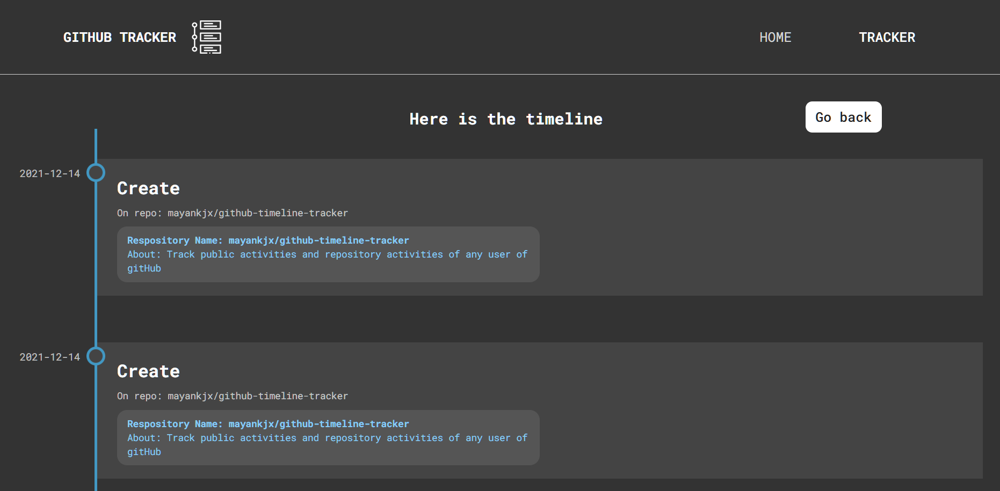

# About



Hello! This project is a VUE JS build and implemented state management using VUEX. State management wasnt needed
for this project, but for the sake of learning I implemented it.
The application uses conditional rendering and list rendering to render different components based on the state
of application. Animation are done using Animate.css library and Vue inbuilt classes for animation.

## Tech Stack

- Frontend Framework : VUE JS
- Design : Vanilla CSS, Animation.CSS
- State Management : VUEX
- API : Github API

### Techaways

- Must have made different components for different sections of page to avoid cluttering of data
- Different components wouldve organized the methods and computed properties
- SCSS wouldve reduced the repetition caused by vanila CSS

## Project setup
```
npm install
```

### Compiles and hot-reloads for development
```
npm run serve
```

### Compiles and minifies for production
```
npm run build
```

### Customize configuration
See [Configuration Reference](https://cli.vuejs.org/config/).
